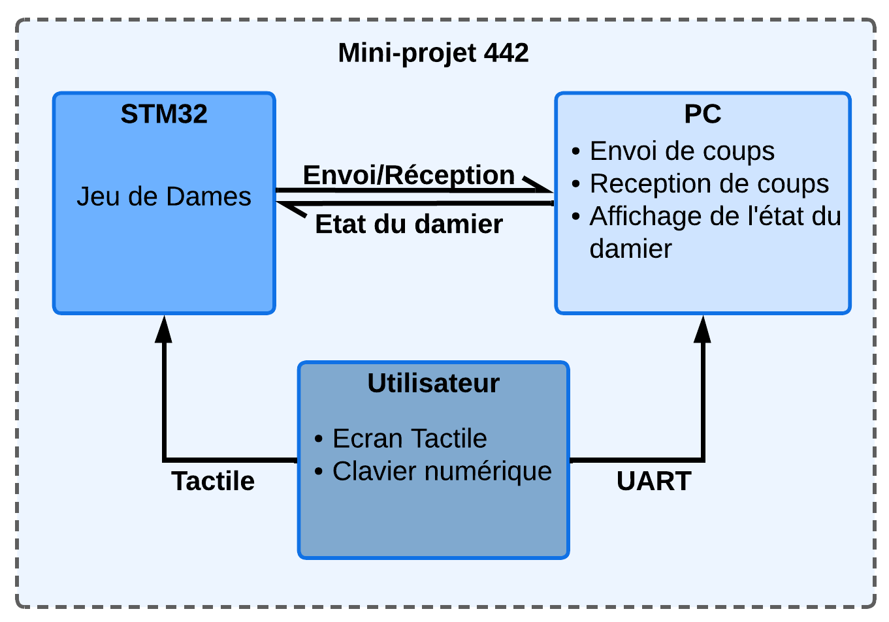

# Projet-442
Rapport du projet de l'UE 442 (Informatique Industrielle) du M1 E3A de l'ENS Paris-Saclay. 
<div align="center" style="margin-top:20px; margin-bottom:20px;">
      
      <p style="font-size:75%;"><em>Schéma du Projet.</em></p>
</div>

Ce github présente deux programmes, le jeu de Dames seul ainsi que l'implémentation de la communication avec le PC et l'affichage de l'état du damier sur le PC. 
## Jeu de Dames
Dossier : ```Jeu de Dames```<br>
Il est composé de 3 tâches :
1. **Tâche d'affichage**<br>
  La tâche ```Display_jeu(void const * argument)``` permet d'afficher l'état du Damier sur l'écran LCD. Pour ce faire on utilise une variable globale ```damier```. <br>
  L'affichage est effectué à chaque changement d'état du damier et utilise un Mutex. Pour transmettre l'information que l'état du damier à changé, plusieurs pistes ont été étudiées. D'abord l'utilisation des *Events*, mais cela n'a pas abouti. Cette méthode est intéressante car elle permet d'étudier une alternative aux *Queue*. Ensuite les *Task Notifications* qui sont une alternative plus légère que les *Events* mais cette méthode n'a pas non plus fonctionnée. 
  Enfin les *Queue* ont été utilisées pour transmettre l'information du changement d'état.<br>
Afin de poursuivre ce projet et d'éventuellement utiliser les *Events* ou les *Task Notifications*, il suffit de décommenter à la fois dans la tâche d'affichage et la tâche de coups les lignes de codes correspondantes.

2. **Tâche de coup**<br>
  La tâche ```Select_pion(void const * argument)``` permet de modifier l'état du damier à partir d'une touche sur l'écran LCD. <br>
  Cette tâche prend en compte tous les types de coups possibles, toutes les captures possibles et la transformation d'un pion en dame.

3. **Tâche de victoire**<br>
   La tâche ```victoire(void const * argument)``` vérifie l'état du damier a une fréquence moins élevée que les deux autres tâches et déclenche l'affichage du vainqueur lorsque l'un des deux joueurs n'a plus de pion.<br>
   Cette tâche présente un affichage d'une coupe à l'aide de la fonction ```BSP_LCD_FillPolygon```.

## Communication UART avec le PC.
Dossier : ```Comm UART```<br>
Cette partie se base sur le jeu de Dames présenté précédemment et ajoute une tâche permettant de gérer la réception/transmission UART. On y ajoute aussi un programme python permettant d'afficher le damier sur le PC (la partie d'affichage sur le PC ne fonctionne pas correctement). <br>
Cette tâche présente donc deux parties, la première qui est la réception du coup. Le PC doit envoyer 'M' suivi de 4 octets représentants les lignes et colonnes du pion à bouger et les lignes et colonnes de la case libre ou le déplacer. La seconde qui est l'envoie de l'état du damier. Pour ce faire à chaque coup tactile depuis la carte STM32 on envoit l'état du damier.<br>
Cette partie se base sur ce que l'on a vu en TP sur les liaisons UART. <br>
L'affichage sur Python utilise la librairie pygame, et le programme s'inspire de ce que j'ai pu voir sur internet pour faire un affichage du damier.
